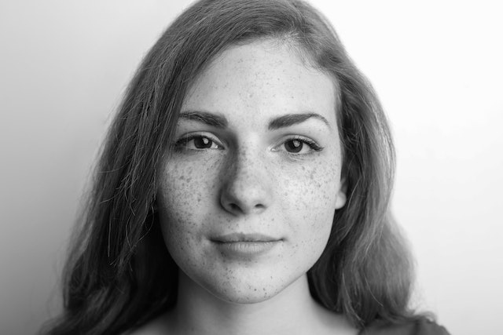

# Beautification
Use the frequency techniques to beautify picture

## Table of Contents
- [Beautification](#beautification)
  - [Table of Contents](#table-of-contents)
  - [作業要求](#作業要求)
  - [I. Introduction](#i-introduction)
  - [II. Algorithms](#ii-algorithms)
    - [2.1 Ideal Lowpass Filter](#21-ideal-lowpass-filter)
    - [2.2 Butterworth Lowpass Filter](#22-butterworth-lowpass-filter)
    - [2.3 Gaussian Lowpass Filter](#23-gaussian-lowpass-filter)
  - [III. Method](#iii-method)
    - [3.1 Face Mask](#31-face-mask)
    - [3.2 Apply Filters](#32-apply-filters)
    - [3.3 Combination of Filters](#33-combination-of-filters)
  - [IV. Results and Discussion](#iv-results-and-discussion)
    - [4.1 Result](#41-result)
    - [4.2 Individual Filter Results](#42-individual-filter-results)
    - [4.3 Combination of Filters](#43-combination-of-filters)
    - [4.4 Discussion](#44-discussion)
## 作業要求
1. Get several face pictures.
2. Generate two kinds of enhanced pictures: one represents the pictures before beautification, the other after beautification. Please use the frequency techniques as the primary methods.

## I. Introduction

利用 frequency techniques 進行圖像美化，主要針對減少皮膚瑕疵的影響。
根據 CH4 投影片第 130 到 146 頁的資訊，我選用了三種不同的濾波器，分別是 Ideal Filter、Butterworth Filter、Gaussian Filter，以觀察及比較他們的效果。

## II. Algorithms

### 2.1 Ideal Lowpass Filter
使頻率小於截止頻率的所有信號都通過，且沒有失真，並阻擋頻率高於截止頻率的所有信號。

* Transfer Function

    ${\Large  H(u,v) = \left\{\begin{matrix}1  & if \ D(u,v)\le D_{0}  \\0  & if \ D(u,v) >  D_{0}\end{matrix}\right.}$

* Implementation
1. 對輸入的圖片進行快速傅立葉轉換(FFT)，得到頻譜。
2. 使用 FFT 移位將零頻分量移位到頻譜的中心。
3. 根據 cutoff 的值，將某些頻率分量設置為0。
4. 進行逆 FFT，得到濾波後的圖片。

*  Code
```python
def ideal_filter(img, cutoff):
    f = np.fft.fft2(img)
    fshift = np.fft.fftshift(f)

    rows, cols = fshift.shape
    mask = np.zeros((rows, cols), dtype='float')

    crow, ccol = rows / 2, cols / 2

    for i in range(rows):
        for j in range(cols):
            c = np.sqrt((i - crow) ** 2 + (j - ccol) ** 2)
            if c <= cutoff:
                mask[i, j] = 1
            else:
                mask[i, j] = 0

    fshift = fshift * mask

    f_ishift = np.fft.ifftshift(fshift)
    img_filtered = np.fft.ifft2(f_ishift)
    img_filtered = np.abs(img_filtered)

    return img_filtered
```
### 2.2 Butterworth Lowpass Filter
特點是在截止頻率附近具有平滑的過渡區域，可以有效地減少高頻噪聲，同時保留較多的圖像細節。

* Transfer Function

    ${\Large  H(u,v) = \cfrac{1}{1 \ + \ \left [\,D(u,v)/D_{0} \,\right ]^{2n}  }}$

* Implementation
1. 對輸入的圖片進行快速傅立葉轉換(FFT)，得到頻譜。
2. 使用 FFT 移位將零頻分量移位到頻譜的中心。
3. 計算 Butterworth transfer function，用來建立 Butterworth frequency mask。
4. 將 frequency mask 套用到移位後的頻譜。
5. 進行逆 FFT，得到濾波後的圖片。

*  Code
```python
def butterworth_filter(img, cutoff, order):

    f = np.fft.fft2(img)
    fshift = np.fft.fftshift(f)

    rows, cols = fshift.shape
    crow, ccol = rows / 2, cols / 2
    mask = np.zeros((rows, cols), dtype='float')

    for i in range(rows):
        for j in range(cols):
            mask[i, j] = 1 / (1 + ((np.sqrt((i - crow) ** 2 + (j - ccol) ** 2)) / cutoff) ** (2 * order))

    fshift = fshift * mask

    f_ishift = np.fft.ifftshift(fshift)
    img_filtered = np.fft.ifft2(f_ishift)
    img_filtered = np.abs(img_filtered)

    return img_filtered
```
### 2.3 Gaussian Lowpass Filter
對整幅圖像進行加權平均的過程，每一個像素點的值，都由其本身和鄰域內的其他像素值經過加權平均後得到。

* Transfer Function

    ${\Large  H(u,v) = e^{-D^{2}(u,v)/2D_{0}^{2} }}$

* Implementation
1. 對輸入的圖片進行快速傅立葉轉換(FFT)，得到頻譜。
2. 使用 FFT 移位將零頻分量移位到頻譜的中心。
3. 對每個頻率分量計算 Gaussian transfer function，用來建立 Gaussian frequency mask。
4. 將 frequency mask 套用到移位後的頻譜。
5. 進行逆 FFT，得到濾波後的圖片。

*  Code
```python
# Gaussian Filter
def gaussian_filter(img, sigma):

    f = np.fft.fft2(img)
    fshift = np.fft.fftshift(f)

    rows, cols = fshift.shape
    crow, ccol = rows / 2, cols / 2
    mask = np.zeros((rows, cols), dtype='float')

    for i in range(rows):
        for j in range(cols):
            mask[i, j] = np.exp(-((i - crow) ** 2 + (j - ccol) ** 2) / (2 * sigma ** 2))

    fshift = fshift * mask

    f_ishift = np.fft.ifftshift(fshift)
    img_filtered = np.fft.ifft2(f_ishift)
    img_filtered = np.abs(img_filtered)

    return img_filtered
```
## III. Method

### 3.1 Face Mask
希望只針對需要圖片美化的部分進行處理，以選用的圖片為例，圖片中的女孩臉頰上有大量雀斑，主要目標為消除臉上的雀斑，因此將其他不需要進行濾波的部分建立 mask，並跟據此 mask 對需要美化的部分進行濾波。



#### 3.1.1 臉部以外的區域
```python
all_face = np.zeros_like(img)
all_face = cv2.ellipse(all_face, (315, 210), (120, 170), 0, 0, 360, 255, -1)
```


#### 3.1.2 眼睛、眉毛、鼻孔、嘴巴
```python
face_mask = np.zeros_like(img)
cv2.ellipse(face_mask, (250, 172), (42, 32), 0, 0, 360, 255, -1)
cv2.ellipse(face_mask, (380, 172), (42, 32), 0, 0, 360, 255, -1)
cv2.ellipse(face_mask, (315, 310), (45, 15), 0, 0, 360, 255, -1)
cv2.circle(face_mask, (300, 265), 6, 255, -1)
cv2.circle(face_mask, (330, 265), 6, 255, -1)
```


#### 3.1.3 對特定部分進行濾波

```python
def area_filter(filtered_img):
    rows, cols = img.shape
    mask_img = np.zeros((rows, cols), dtype='float')
    for i in range(rows):
        for j in range(cols):
            if(all_face[i, j] == 255 and face_mask[i, j] != 255):
                mask_img[i, j] = filtered_img[i, j]
            else:
                mask_img[i, j] = img[i, j]
    return mask_img
```

### 3.2 Apply Filters

將圖片分別套用不同濾波器，並只對特定部分進行濾波

```python
cutoff_frequency = 35
ideal_filtered = area_filter(ideal_filter(img, cutoff_frequency))

cutoff_frequency = 25
order = 2
butterworth_filtered = area_filter(butterworth_filter(img, cutoff_frequency, order))

sigma = 25
gaussian_filtered = area_filter(gaussian_filter(img, sigma))
```
### 3.3 Combination of Filters
組合不同的濾波器，以增強效果，組合的方法為將不同濾波器的結果相加後取平均。

```python
ideal_butterworth_filtered = area_filter((ideal_filtered + butterworth_filtered) / 2)
butterworth_gaussian_filtered = area_filter((butterworth_filtered + gaussian_filtered) / 2)
ideal_gaussian_filtered = area_filter((ideal_filtered + gaussian_filtered) / 2)
img_filtered = area_filter((ideal_filtered + butterworth_filtered + gaussian_filtered) / 3)
```

## IV. Results and Discussion

### 4.1 Result
所有生成圖片與輸入圖片的對比圖


### 4.2 Individual Filter Results

#### 4.2.1 Ideal Lowpass Filter
平滑效果較差，圖像的噪點有減少，但不夠平滑。


#### 4.2.2 Butterworth Lowpass Filter
平滑效果不錯，保留的細節也是最多的，像是唇角及蘋果肌都比其他種濾波器更為明顯。


#### 4.2.3 Gaussian Lowpass Filter
平滑效果最好，但某些區域的清晰度略微下降，像是唇角及蘋果肌就比 Butterworth Lowpass Filter 還要不明顯。


### 4.3 Combination of Filters
不同濾波器各有優缺，因此相互結合可以彌補缺點，從結果來看，不同的組合都讓生成的圖片在降噪與細節間取得了不錯的平衡，也許調整結合的比重可以獲的更好的效果。

#### 4.3.1 Ideal Butterworth Filter


#### 4.3.2 Butterworth Gaussian Filter


#### 4.3.3 Ideal Gaussian Filter


#### 4.3.4 Overall Combination 


### 4.4 Discussion

根據獲得的結果，可以看出各個濾波器，包括 Ideal filter、Butterworth filter 和 Gaussian filter，在降噪、保持銳度和整體平滑方面展現不同的特性。過濾器的組合通過利用每個過濾器的優勢提供了改進的結果。

而需要注意的部分是參數的選擇，例如截止頻率、階數和 sigma 值，如果根據不同的圖片進行參數選擇，並調整結合濾波器的比重，這些對於取得最佳結果至關重要。


